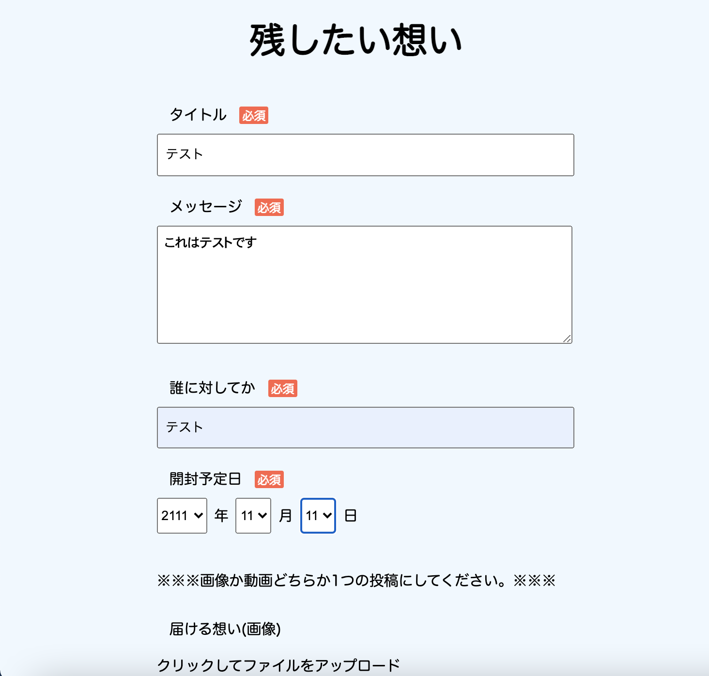
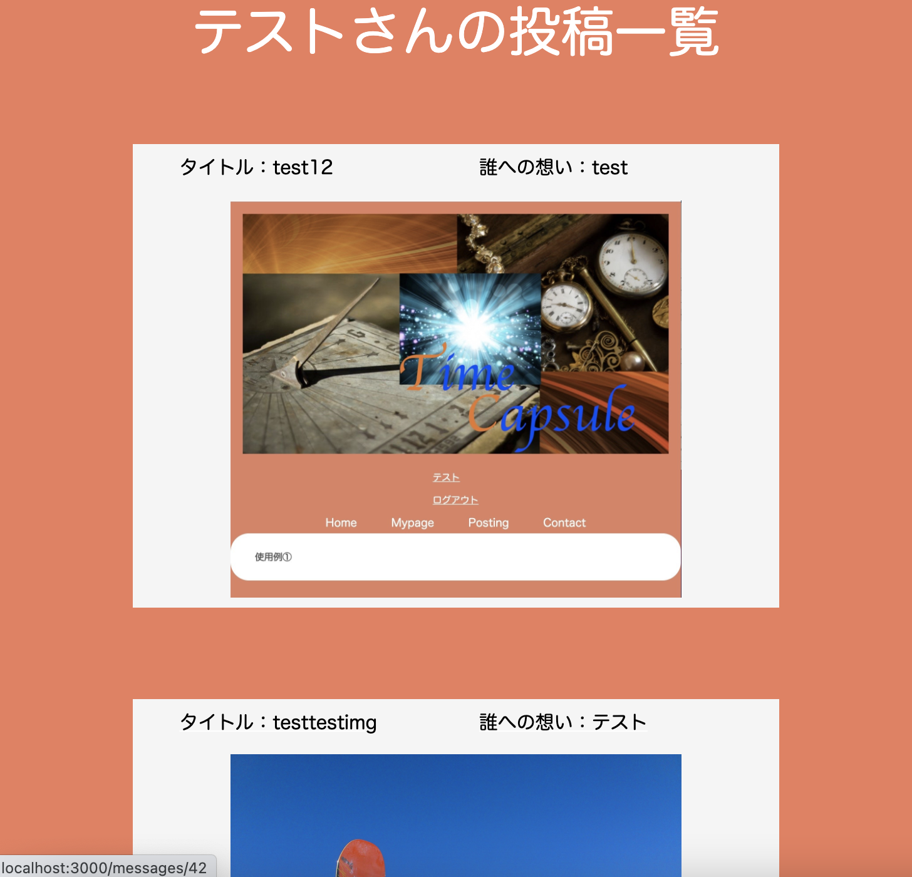
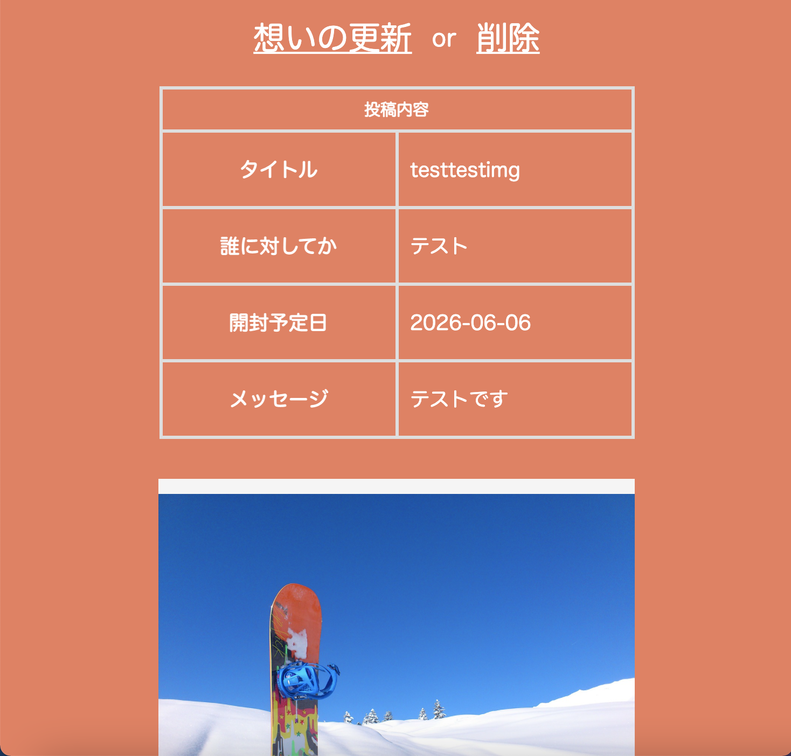

# README

This README would normally document whatever steps are necessary to get the
application up and running.

Things you may want to cover:

* Ruby version

* System dependencies

* Configuration

* Database creation

* Database initialization

* How to run the test suite

* Services (job queues, cache servers, search engines, etc.)

* Deployment instructions

* ...

# アプリケーション名
## TimeCapsule

# アプリケーション概要
未来に残したり伝えたい想いを画像や動画にして残しておくアプリです

# URL
https://time-capsule1260.herokuapp.com/

# テスト用アカウント
テストユーザー1

メールアドレス：test@test.com

パスワード：shunxile1260

# 利用方法

①アカウントを作成する

②Postingから新規投稿ページへ移動する

③投稿後開封したい日に投稿記事をか閲覧する

# 目指した課題解決
近年周りの環境は目まぐるしく変わり、変わらないだろうと思っていたものまで変わっていっている。そういった環境下で、タイムカプセルを埋めたりなどしても、思いがけないことで掘り起こされたり、そもそも建設予定などで埋める許可がおりず場所の確保ができない状態を解決するためにこのアプリを開発しました。また、未来に想いを残すという点で生まれたての赤ん坊に向けたメッセージなどを残し成長した後や結婚などの節目の時に見てもらうといったことに活用してもらいたいと思います。

# 洗い出した要件
#### 当時のことを思い出せるような物の写真などを保管しておく
#### 生まれた子に対して数年後、何十年後に向けてのメッセージや動画を残しておく

# 実装した機能についてのGIFと説明
##### 新規投稿機能
タイトル・メッセージ・誰に宛てたものか・開封予定日・タグの必須情報を入力することで新しく記事を投稿することができる。

##### 個人投稿一覧機能
特定ユーザー１人が投稿した記事を一覧で表示され表示されている記事１つを選択する事で記事の詳細画面へ遷移することができる。

##### 投稿詳細機能
投稿された記事の内容を閲覧するためのページへ遷移することができ、このページから投稿内容の編集や削除することができる。

# 実装予定の機能
##### 投稿記事閲覧制限機能
投稿したものを閲覧するのに制限を設けるためにパスワードを設定しパスワード入力まではダミー画像を表示させる

##### 投稿記事詳細検索機能
投稿された記事のタイトルやタグ、誰に宛てたものか、投稿したユーザーを用いて投稿された記事を検索できるようにする

# データベース設計
## users
| Column             | Type   | Options                   | 
| ------------------ | ------ | ------------------------- | 
| last_name          | string | null: false               | 
| first_name         | string | null: false               | 
| last_name_kana     | string | null: false               | 
| first_name_kana    | string | null: false               | 
| nickname           | string | null: false               | 
| email              | string | null: false, unique: true | 
| encrypted_password | string | null: false               | 
| date_birth         | date   | null: false               | 

### Association
- has_many :messages

## messages テーブル
| Column             | Type       | Options     | 
| ------------------ | ---------- | ----------- | 
| title              | string     | null: false | 
| whom               | string     | null: false | 
| message            | text       |             | 
| open_plan          | data       | null: false | 
| encrypted_password | string     | null: false | 
| user_id            | references | null: false | 

### Association
- belongs_to :user
- has_many_attached :images
- has_one_attached :video
- has_many :message_tag_forms, dependent: :destroy
- has_many :tags, through: :message_tag_forms

## tags テーブル
| Column | Type       | Options                       | 
| ------ | ---------- | ----------------------------- | 
| name   | string     | null: false, uniqueness: true | 

### Association
- has_many :messages, through: :message_tag_forms
- has_many :message_tag_forms

### message_tag_forms テーブル
| Column  | Type       | Options                        | 
| ------- | ---------- | ------------------------------ | 
| message | references | null: false, foreign_key: true | 
| tag     | references | null: false, foreign_key: true | 

### Association
- belongs_to :message
- belongs_to :tag
